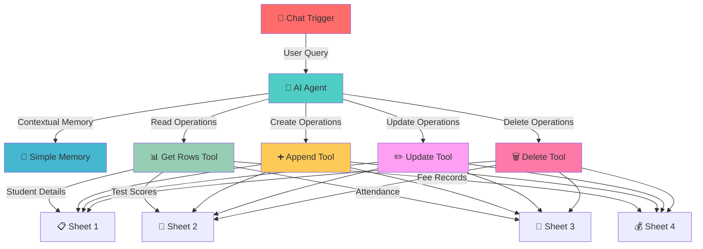

<div align="center">

# 🚀 AskMySheets

### *AI-powered Student Database Assistant* 📚🤖

 +  +  = ✨ **Magic**

[](https://n8n.io)
[](https://openai.com)
[](https://sheets.google.com)
[](https://opensource.org/licenses/MIT)

---

## 🎯 What is this sorcery?

Transform your **Student Database** into an intelligent conversational assistant! Manage 4 comprehensive sheets through natural language - no more complex formulas or manual data entry!

</div>

---

## 📊 Your Complete Student Management System

<div align="center">

| 📋 **Student Details** | 📝 **Test Scores** | 📅 **Attendance & Activities** | 💰 **Fee Records** |
|:---:|:---:|:---:|:---:|
| Basic student info | Academic performance | Daily attendance logs | Payment tracking |

</div>

---

## 🔥 Features That'll Blow Your Mind

<div align="center">

| 💬 **Natural Chat** | 🧠 **Smart Memory** | ⚡ **4 Sheet Types** | 🎨 **Zero Code** |
|:---:|:---:|:---:|:---:|
| Talk like a human | AI remembers context | Complete student data | No formulas needed |

</div>

### 🛠️ Full CRUD Operations

<div align="center">
<table>
<tr>
<td align="center">
<br>
<b>📊 READ</b><br>
<sub>Query any student data</sub>
</td>
<td align="center">
<br>
<b>➕ CREATE</b><br>
<sub>Add new records</sub>
</td>
<td align="center">
<br>
<b>✏️ UPDATE</b><br>
<sub>Modify existing data</sub>
</td>
<td align="center">
<br>
<b>🗑️ DELETE</b><br>
<sub>Remove records/columns</sub>
</td>
</tr>
</table>
</div>

```bash
👤 "Show me top 5 students with highest test scores"
🤖 Analyzing Test Scores sheet... ✨
📊 Top Performers:
   1. Alice Johnson - 98% (Mathematics)
   2. Bob Smith - 96% (Physics) 
   3. Carol Davis - 94% (Chemistry)
   4. David Wilson - 92% (Biology)
   5. Emma Brown - 90% (English)
```

---

<div align="center">

## 🏗️ Workflow Architecture

</div>



### 🔧 Technical Stack

<div align="center">
<table>
<tr>
<th>Component</th>
<th>Technology</th>
<th>Version</th>
<th>Purpose</th>
</tr>
<tr>
<td>🤖 AI Agent</td>
<td>LangChain Agent</td>
<td>v2.2</td>
<td>Query interpretation & tool orchestration</td>
</tr>
<tr>
<td>🧠 Memory</td>
<td>Buffer Window</td>
<td>v1.3</td>
<td>Conversation context retention</td>
</tr>
<tr>
<td>💬 Trigger</td>
<td>Chat Trigger</td>
<td>v1.3</td>
<td>Real-time chat interface</td>
</tr>
<tr>
<td>📊 Database</td>
<td>Google Sheets API</td>
<td>v4.7</td>
<td>Data storage & manipulation</td>
</tr>
<tr>
<td>🧠 LLM</td>
<td>GPT-4o Mini</td>
<td>Latest</td>
<td>Natural language understanding</td>
</tr>
</table>
</div>

---

<div align="center">

## 🚀 Quick Start

</div>

### 📦 What You Need

<div align="center">

<table>
<tr>
<td align="center">
<br>
<b>n8n Platform</b><br>
<sub>Version 1.0+</sub><br>
<a href="https://n8n.io/cloud/">☁️ Cloud</a> | <a href="https://docs.n8n.io/hosting/installation/">💻 Self-hosted</a>
</td>
<td align="center">
<br>
<b>OpenAI API</b><br>
<sub>GPT-4o Mini Access</sub><br>
<a href="https://platform.openai.com/api-keys">🔑 Get API Key</a>
</td>
<td align="center">
<br>
<b>Google Sheets</b><br>
<sub>OAuth2 or Service Account</sub><br>
<a href="https://console.cloud.google.com/">⚙️ Setup API</a>
</td>
</tr>
</table>

</div>

### ⚡ Installation (3 Simple Steps!)

```bash
# 1️⃣ Download the workflow
curl -L -o AskMySheets.json https://github.com/Abhishek88788/n8n-AskMySheets/raw/main/AskMySheets.json

# 2️⃣ Import to n8n
# Drag & drop AskMySheets.json into your n8n instance

# 3️⃣ Configure credentials
# Set up OpenAI API key and Google Sheets OAuth2
```

---

<div align="center">

## 🎪 Real Workflow Demo

*Actual conversations with your student database!*

</div>

<div align="center">
<table>
<tr>
<th>🤔 What You Ask</th>
<th>📊 Sheet Accessed</th>
<th>🤖 AI Response</th>
</tr>
<tr>
<td><code>"Find students with attendance below 80%"</code></td>
<td>📅 Attendance & Activities</td>
<td>📋 Found 7 students: John (75%), Sarah (70%)...</td>
</tr>
<tr>
<td><code>"Add new student: Mike Wilson, Grade 10"</code></td>
<td>📋 Student Details</td>
<td>✅ Added Mike Wilson to row 156</td>
</tr>
<tr>
<td><code>"Update Alice's math test score to 95"</code></td>
<td>📝 Test Scores</td>
<td>✏️ Updated Alice Johnson's Math score to 95%</td>
</tr>
<tr>
<td><code>"Show unpaid fees for this month"</code></td>
<td>💰 Fee Records</td>
<td>💰 12 students have pending payments totaling $3,450</td>
</tr>
</table>
</div>

---

<div align="center">

## 🔧 Configuration Details

</div>

<details>
<summary><b>🤖 AI Agent Settings</b></summary>

```json
{
  "type": "@n8n/n8n-nodes-langchain.agent",
  "version": "2.2",
  "systemMessage": "We only have 4 sheets: Student Details, Test Scores, Attendance & Activities, Fee Records. These sheets contain data as per their name.",
  "tools": [
    "Get rows", "Append row", "Update row", "Delete rows/columns"
  ]
}
```

**System Prompt Configuration:**
- Knows about 4 specific sheets
- Understands data structure
- Optimized for educational use cases
</details>

<details>
<summary><b>📊 Google Sheets Configuration</b></summary>

```json
{
  "documentId": "1A3vOaSVVZ-TUOTsiKe7WF-Vjz8Nq7W4gzEVnjPcgFIQ",
  "sheetNames": [
    "Student Details",
    "Test Scores", 
    "Attendance & Activities",
    "Fee Records"
  ],
  "operations": ["read", "append", "update", "delete"],
  "auth": "googleSheetsOAuth2Api"
}
```

**Sheet Structure:**
- **Student Details**: Basic info, contact, enrollment
- **Test Scores**: Subject, date, score, Student ID mapping  
- **Attendance**: Daily records, activities participation
- **Fee Records**: Payment status, amounts, due dates
</details>

<details>
<summary><b>🧠 Memory & LLM Settings</b></summary>

```json
{
  "memory": {
    "type": "bufferWindow",
    "version": "1.3",
    "windowSize": 10
  },
  "llm": {
    "model": "gpt-4o-mini",
    "provider": "OpenAI",
    "temperature": 0.3
  }
}
```

**Optimized for:**
- Educational queries
- Multi-sheet operations  
- Context retention across conversations
</details>

---

<div align="center">

## 🎓 Educational Use Cases

</div>

<div align="center">
<table>
<tr>
<td align="center">
<br>
<b>📋 Student Management</b><br>
<sub>"Show all Grade 10 students"<br>
"Add new student enrollment"</sub>
</td>
<td align="center">
<br>
<b>📝 Academic Tracking</b><br>
<sub>"Find failing students in Math"<br>
"Update test scores for Physics"</sub>
</td>
</tr>
<tr>
<td align="center">
<br>
<b>📅 Attendance Analysis</b><br>
<sub>"Show attendance trends"<br>
"Mark students absent today"</sub>
</td>
<td align="center">
<br>
<b>💰 Fee Management</b><br>
<sub>"List unpaid fees"<br>
"Update payment status"</sub>
</td>
</tr>
</table>
</div>

### 🎯 Advanced Query Examples

```bash
# 📊 Complex Analytics
"Calculate average attendance for Grade 11 students last month"

# 🔄 Multi-sheet Operations  
"Find students with low grades AND poor attendance"

# 📈 Trend Analysis
"Show test score improvements over the semester"

# 🚨 Alert Generation
"List students who need academic intervention"
```

---

<div align="center">

## ⚙️ Customization Guide

</div>

### 🔄 Adapting to Your School

<details>
<summary><b>📋 Modify Sheet Structure</b></summary>

1. **Update System Message**:
```javascript
// In AI Agent node, modify systemMessage:
"We have 5 sheets: Student Details, Grades, Attendance, Fees, Extracurriculars"
```

2. **Add New Sheets**:
   - Create new Google Sheets tool nodes
   - Connect to AI Agent as tools
   - Update sheet names in configuration

3. **Custom Fields**:
   - Modify column mappings in Update/Append nodes
   - Add new schema fields as needed
</details>

<details>
<summary><b>🎨 Customize AI Responses</b></summary>

```javascript
// Example: Make responses more formal
"You are a professional school administrator assistant. Always respond formally and include relevant student policies."

// Example: Add data validation
"Before updating records, always verify student ID exists and grades are within valid range (0-100)."
```
</details>

---

<div align="center">

## 🤝 Join the Education Revolution!

</div>

<div align="center">

[](https://github.com/Abhishek88788/n8n-AskMySheets/stargazers)
[](https://github.com/Abhishek88788/n8n-AskMySheets/network)
[](https://github.com/Abhishek88788/n8n-AskMySheets/issues)

</div>

### 🎯 How to Contribute

1. 🍴 Fork this educational revolution
2. 🔧 Add your school's magic touch  
3. 🚀 Submit a PR with improvements
4. 🎉 Get featured as an education innovator!

<div align="center">

### 💡 Feature Ideas Welcome!

- 📱 **Mobile App Integration** - React Native companion
- 📊 **Data Visualization** - Charts and dashboards  
- 🔔 **Smart Notifications** - Automated alerts for parents
- 🌐 **Multi-language Support** - Global school compatibility
- 🔐 **Role-based Access** - Teacher/Admin/Parent permissions
- 📈 **Predictive Analytics** - Student performance forecasting

</div>

---

<div align="center">

## 🏆 Community & Support

</div>

<div align="center">
<table>
<tr>
<td align="center">
<a href="https://discord.gg/n8n"></a><br>
<b>💬 Discord Chat</b>
</td>
<td align="center">
<a href="https://community.n8n.io/"></a><br>
<b>🗣️ n8n Forum</b>
</td>
<td align="center">
<a href="https://twitter.com/n8n_io"></a><br>
<b>🐦 Twitter Updates</b>
</td>
</tr>
</table>
</div>

### 🐛 Troubleshooting

<details>
<summary><b>❌ Common Issues & Solutions</b></summary>

**Authentication Errors:**
- ✅ Verify Google Sheets OAuth2 credentials
- ✅ Check spreadsheet sharing permissions  
- ✅ Ensure Sheets API is enabled

**AI Agent Not Responding:**
- ✅ Confirm OpenAI API key is valid
- ✅ Check credit balance in OpenAI account
- ✅ Verify GPT-4o-mini model access

**Sheet Operations Failing:**
- ✅ Validate spreadsheet ID in configuration
- ✅ Check if target sheets exist with correct names
- ✅ Ensure proper column headers match schema
</details>

---

<div align="center">

## 🙏 Credits & Acknowledgments


*Built with* ❤️ *for educators worldwide using:*

[](https://n8n.io)
[](https://openai.com)
[](https://sheets.google.com)
[](https://langchain.com)

</div>

---

<div align="center">

### 🎓 Transform Your School's Data Management Today!

*From spreadsheet chaos to intelligent conversations in minutes* ✨

[](https://github.com/Abhishek88788/n8n-AskMySheets/raw/main/AskMySheets.json)
[](https://github.com/Abhishek88788/n8n-AskMySheets)

**Webhook ID**: `3f99f841-89ea-4770-b510-43778a1880f5`  
**Workflow ID**: `pIK62ydikD4tdlv7`

</div>
